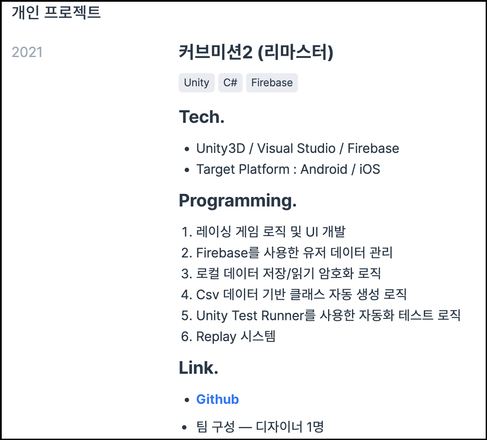

> 들어가며

　새로운 회사로 이직한지 2개월 정도 되었다. 이직 후에 시간이 남을 때 관련된 글을 쓰려고 했는데 미루고 미루다 이제야 쓰려고 한다(지금도 쓰기 귀찮긴 한데.. 시간이 너무 남아서ㅎ). 원래는 [**4년 차 회고**]라는 주제로 이때까지 겪어온 이야기를 쓰려고 했는데 쓰다보니까 진짜 너무 **개노잼+징징**의 연속이라 바로 접었다\...ㅎㅎ.. (나중에 심심하면 써봐야지)
    
　그래서! 재미는 없어도 미래의 나에게, 그리고 이 글을 보면서 이직을 생각하며 여러 글을 읽고 있을 누군가에게 도움이 됐으면 하는 마음에 내가 해왔던 이직 준비에 대한 글을 쓰려고 한다. 😎  
    

> 이직 준비

나는 이직 준비할 때 필요한 내용들을 먼저 리스트업했다.

- 코딩 테스트
- Computer Science 
- 개인 프로젝트
- 이력서 & 포트폴리오
- 면접
  

　물론 이를 제외하고도 이직에 필요한 능력은 많다. 예를 들면 말을 잘한다거나, 다른 회사에서 추천해줄 수 있는 지인, ~~내가 했던 내용을 부풀리는 능력(이러면 안 됩니당\...)~~ 등\... 하지만 이 글에서는 혼자서 준비할 수 있는 부분들만 다룰 예정이라 패스하겠다.
    
　지금부터 위 내용들을 하나씩, 내가 어떻게 준비했는지에 대해 풀어보겠다.  
    

> 코딩 테스트

　먼저 나는 학부 시절부터 알고리즘 스터디에 참여했었다. 당시에 프로그래머 공채 전형에는 거의 99% 코딩 테스트가 포함되어 있었고, 지금까지도 코딩 테스트가 없는 전형은 거의 없다시피(흔히 말하는 ***머기업***들에는) 하므로 코딩 테스트 준비는 필수다. 코딩 테스트와 관련된 글을 구글링해 보면 좋은 노하우들이 많다. 나도 그런 글들을 참고해서 공부했다.  
    
　서론은 이쯤하고, 나는 학부 시절 함께 스터디했던 스터디원 2명과 함께 [**주 1회 온라인 알고리즘 스터디**]를 진행하면서 코딩 테스트를 준비했다. 기간은 이직 전까지 약 2년 넘게 **주 1회**를 유지하면서 진행했다. 기본적인 규칙은 [**백준&프로그래머스 1문제 해결**]을 과제로 해오고, 정기 온라인 미팅에서는 해당 문제에 대한 서로의 코드와 풀이법을 공유하고 리뷰하는 형식이었다.  
    
　그런데 진행하다 보니 학부 시절과 다를 바가 없다고 느껴져서 기초도 다시 다지고, 좀 더 심화 과정을 공부하고 싶은 니즈가 생겼다. 그래서 [Introduction to Algorithm](https://ko.wikipedia.org/wiki/Introduction_to_Algorithms)의 pdf를 구해서 챕터별로 개인 스터디를 진행하고, 필요한 경우에는 알고리즘을 직접 구현해서 공유하고 리뷰를 진행했다(+해당 챕터와 관련된 백준&프로그래머스 1문제 해결은 계속 진행했다).  
    
　스터디를 진행하면서 스터디원들이 관심이 생긴 알고리즘이 있으면 소개하고, 모두가 동의하면 해당 알고리즘을 공부하는 회차도 자유롭게 추가하면서 스터디를 진행했다. 나는 이 스터디 기록을 남기고 싶어서 문제를 풀 때마다 [블로그](https://gyutaelee.github.io/categories/#algorithm)에 글을 남겼고, 중요하고 다시 보고 싶은 [알고리즘 개념](https://gyutaelee.github.io/tags/#introduction-to-algorithms)들도 정리해서 글을 남겼으니 보고 싶다면 블로그 글을 참고하면 된다.  
    
　사실 이 스터디 방식은 추천하면서 추천하지 않는다(***뭐라는 거냐?***🤔). 그 이유는 스터디원들의 자율성이 너무 보장되기 때문에 한 명이라도 느슨해지면 스터디가 망가질 수 있기 때문이다. 우리 스터디원들은 모두 열정이 있고 꾸준히 노력할 줄 아는 사람들이었기 때문에 성공적으로 스터디가 2년 이상 유지되고 있다고 생각한다. 만약 코딩 테스트 스터디를 이와 비슷하게 진행하려고 하면 규칙을 강제성 있게 만들거나, 포기하지 않을만한 팀원들을 데리고 하는 것을 추천한다(***중간에 스터디 깨지면 본인의 시간과 멘탈에도 문제가 생길 수 있기 때문에.. 신중하게!*** 😾)  

> Computer Science

　흔히 CS라고 말하는 컴퓨터 과학 지식이다. 특히 개발자 신입 공채 면접과 시험을 많이 봤던 입장으로, 어려운 문제들과 개념들을 꽤 경험했다고 생각한다. 그런데 막상 주니어들이 현업에서는 이런 시험 내용들을 쓸 일들이 그렇게 많~이는 없다(없다는 게 아닙니다!! 계속 읽어주세요🫣). 하지만 **로직 최적화, 다양한 플랫폼 및 유저 기기에 대한 대응, 새로운 아키텍처 설계 등** 연차가 쌓이면서 중요한 업무들을 맡게 되면 기본이 되는 Computer Science 지식이 매우 중요하다는 걸 느낀다(***편~안***😌). 결론은 면접 공부용으로도 중요하지만, 실력 있는 프로그래머가 되기 위해서 평소에도 **꾸준한 CS 공부**가 중요하다고 생각한다.
    
　서두는 이쯤하고 이번 이직을 준비하면서 종이책은 한 번도 펴지 않았다(e-book을 봤다는 말이 아니라, 정말 돈 주고 사는 책을 펴지 않았다!). 그렇다고 불법으로 책들을 봤다는 말이 아니다. 개인적으로 종이책 펴는 것을 좋아하지 않긴 하지만, 그것과 관련 없이 면접 준비 수준에서는 블로그와 위키들이 정말 잘 정리되어 있어서 필요한 정보를 찾는 데에는 구글링으로도 충분하다고 생각한다(하지만 새로운 지식을 습득할 때는 원서만 한 게 없죠\... ***구글 번역기 만세***🫡🫡). 하지만 블로그 글을 100% 맹신하면 안 된다. 블로그 글은 공신력이 부족한 경우가 많으므로 내가 100% 확신하고 알던 지식을 재확인하는 용도로는 좋지만, 새로운 지식을 습득할 때는 믿을 수 있는 저자가 집필한 책이나 공식 문서를 확인하는 것을 추천한다.
    
　말이 좀 길어졌는데 나는 학부 시절에 공부했던 걸 바탕으로 **필요한 주제**들을 나열했고, 각 주제별로 구글링을 통해 필요한 지식을 정리하고 공부했다. 내 생각에 이 방법으로 공부하려면 CS에 대한 지식이 기본은 있어야 한다고 생각한다(내가 잘 안다는 건 아니고, 각 주제에 대한 ***인덱싱***이 가능할 정도의 지식이 필요하다는 말!). 클라이언트 개발자 기준으로 정리한 주제들은 다음과 같다.
    

    
　각 주제에 대해 중요한 키워드들을 구글링하고, 그에 대해 이어진 글과 키워드들을 계속해서 검색하면서 공부하고 정리했다. 또한, 프로그래머 면접 질문과 관련된 내용들을 찾아보면서 그 질문에 대한 답을 내가 적어가면서도 개념들을 찾아갔다. 사실 이렇게 공부하면 중구난방이 될 수도 있기 때문에 **크게 추천하지 않는다**(***대체 내가 추천하는 건 뭐지?*** 🥸). CS 지식 공부의 반은 개념 공부라고 생각해서 사람마다 잘 맞는 공부법이 지식수준과 공부 습관에 따라 다를거로 생각한다. 그냥 '이 사람은 이런 식으로도 했구나~' 라고 생각하고 참고만 하면 좋을듯하다.
    
    

> 개인 프로젝트

　가장 중요하지 않을까 싶다. 신입이라면 **코딩 테스트 & CS**가 완벽하다면 충분히 취업이 가능하다고 생각한다(흠 잡을 거 없이 기본이 완벽하다면\... 하지만 개인 프로젝트를 해본 게 중요하긴 하겠지?). 하지만 경력자는 '현업에서 어떤 프로젝트를 했는가, 그 프로젝트에서 어떤 업무를 했고 어떠한 고민을 해보았는가'가 면접관의 입장에서는 가장 궁금할 내용이다. **어? 근데 방금 말을 읽고 보면 이상한 게 있다.** '현업에서 어떤 프로젝트를 했는가가 중요하다면서 왜 개인 프로젝트가 중요하다는 거야?'라고 생각할 수 있다. 내가 개인 프로젝트가 가장 중요하다고 한 이유는, 나는 Unity 개발자로 이직을 준비했는데 ***현업에서는 Unity를 사용한 경험이 거의 전무***하기 때문이다.  
    
　이어서 말하면 현업에서 Unity를 사용하지 않았기 때문에 나는 개인 프로젝트에서 내 Unity 능력을 증명해야 했다. 그러기 위해서 평일 퇴근 후, 주말 시간이 있을 때 등 시간이 남을 때 개인 프로젝트에 시간을 많이 할애했다(기간으로 따지면 약 2년 동안 스터디와 개인 프로젝트로 게임 개발을 진행했다).  
    
　초반에는 그냥 게임을 재밌게 만들려고 아이디어와 구현에 치중했었는데, 프로젝트를 진행하면서 이직을 생각하다 보니 그냥 구현하는 건 경쟁력이 없다는 생각이 들었다. 그래서 단순히 게임을 만들기보다는 **포트폴리오에서 어필**할 수 있는 기능들을 하나씩 추가해보기도 했고, 이게 ***실제 면접에서도 질문***을 받으면서 크게 도움이 되었다(마지막에 올릴 포트폴리오에서 보면 이해되실 듯! 🙆‍♂️).  
    
　정리하면 개인 프로젝트는 **현업에서 경험하지 못했던 업무**에 대해 내가 어필할 수 있는 창구라고 생각한다. 이에 더해 이직을 위한 개인 프로젝트라면 **면접관들이 질문할 수 있을 만한 기능**들을 만들어보는 걸 추천한다. 현업에서 개발한 기능을 똑같이 개인 프로젝트에서 구현하면 면접에서 어필할 수 있는 포인트가 늘어나는 게 아니라, 그냥 ***내 개인 프로젝트의 코드만 늘어날 뿐이다***.  

> 이력서 & 포트폴리오

　위 3개를 열심히 준비했다면 이제는 포장할 차례이다. 사담이지만 나는 맛있는 음식, 커피, 술 등을 즐길 때에도 깔끔하고 보기 좋은 분위기에서 즐기는 것을 좋아한다. 이직의 경우에도 같다. 우리가 준비한 내용을 ***보기 좋고, 읽기 좋고, 질문하기 좋게***  만들어서 면접관에게 전달해야 한다.
    
　어떤 식으로 이력서와 포트폴리오를 만들까 많이 고민했다. 구글링을 하면 정말 다양한 템플릿이 나온다. 나도 여러 템플릿도 따라 해보고, 지우고, 수정하고를 반복했다. 결론적으로 이력서는 **프로그래머스**, 포트폴리오는 **노션**을 선택했다. 개인적으로 이력서는 정말 이력만 입력하면 된다고 생각하기 때문에 편하게 만들 수 있는 프로그래머스를 선택했다. 포트폴리오는 내가 클라이언트 개발자이기 때문에 **gif**나 **png**를 넣어야 할 프로젝트가 많아서 가장 보기 좋게 넣을 수 있는 노션을 선택했다. 추가로 둘 다 웹 링크를 전달하면 되기 때문에 수정 및 확인이 용이한 점도 한몫했다.
    

**left(프로그래머스 이력서) / right(노션 포트폴리오)**

　이력서에서 가장 중요시한 점은 '**짧고 굵게**'이고, 포트폴리오에서 가장 중요시한 점은 '**어필할 점을 명확하게, 그리고 질문할 수 있도록**'이다. 이력서에서는 어떤 업무인지를 짧게 적고, 포트폴리오에서는 이력서에서 다 적지 못했지만 좀 더 적고 싶은 내용+이미지를 추가했다. 추가로 포트폴리오에서 **면접관들이 질문을 할 수 있도록** 적으려고 노력했다.
    
　이력서와 포트폴리오를 여러번 첨삭하면서 느낀 점은, 이력서를 너무 자세하게 쓰면 포트폴리오에서 쓸 내용과 겹치게 되는데, 이력서라는 양식의 한계상 포트폴리오보다 표현 자유도가 좁기 때문에 효율적이지 못하다. 그래서 이력서에서는 정말 **어필해야할 단어**들을 신중하게 선택해서 적고, 포트폴리오에서는 이력서에서 적지 못한 내용을 추가했다.
    
    

> 면접

　마지막 단계이다. 면접! 면접 준비는 따로 공부할 게 딱 하나이다. **질문에 어떤 방식으로 대답을 할 것인가?** ~~그리고 이를 준비하는 건 너무 쉽다~~(? 글 오래 쓰다 보니 정신 나간 소리하넹\...🤦‍♂️). 예상 질문들을 적고, 그에 대한 답을 작성해서 꼬리 질문을 만들고 이에 대한 꼬리 답변들도 준비한다. 그렇다, 말은 쉽다\... 면접에 들어가면 준비했던 질문들은 하나도 안 나오고, 다른 방식의 질문만 나오는 경험도 많았다(***멘탈 분쇄기 on***🤪). 그런데도 예상 질문을 만들고 예상 답변을 만드는 것은 그중에 하나라도 나오라는 간절함도 있지만, 스스로 답변을 만들면서 **내 프로젝트를 돌아보고**, 공부한 CS와 알고리즘을 **점검하는 좋은 수단**이 되기 때문이다.  
    
　나는 두 부분으로 나누어 공부했다. 하나는 **Computer Science 문제은행**, 하나는 **포트폴리오 예상 질문**이다. CS 문제은행은 따로 만들 필요가 없다. 두 번째 항목에서 공부했던 CS 내용 중에 중요하다 싶은 **개념들을 암기**하고, 암기만 하는 데서 끝나지 않고 **어떤 상황**에 **어떠한 방식**으로 이 **개념이 쓰였는지**에 대해까지 공부하면 자연스럽게 면접관이 질문을 해도 답변을 할 수 있을 것이다(라고 하지만 어버버 거리는 건 어쩔 수 없다\...ㅜ😭😭 힘내서 알고 있는 내용까지는 ***끝까지*** 답변해보자!).  
    
　포트폴리오 예상 질문은 내가 직접 하나하나 만들어야 한다. 그리고 이 질문을 만들면서 포트폴리오를 많이 수정하게 될 것이다. 먼저 **내가 어필하고 싶은 포인트**를 먼저 찾아야 한다. 내가 한 내용이 아무리 많아도 면접 시간은 한정되어 있고, 내가 지원하는 포지션에서 원하는 내용도 따로 있을 것이다(슈퍼 개발자라면 다 원하려나\...?). 그렇기에 어필하고 싶은 포인트가 면접관이 질문을 하기 편하도록 쓰여있는지를 보면서 포트폴리오를 계속 수정하고, 그 포인트에 대한 예상 질문을 작성하면서 좋은 답변들과 그에 대한 꼬리 질문을 또 예상하고, 그에 대한 답변을 또 작성하면서 준비해야 한다(***꼬리질문..꼬리질문..꼬리질문..끝도 없지만 계속 꼬리질문..준비하자..***😵‍💫)  
    
　그리고 하나 더 알아둘 점! 면접을 보고 나면 멘탈이 **털!려!**있겠지만, 딱 5분만 꽉 잡아두고 면접에서 나온 질문들을 메모해두자. 그리고 다시 멘탈을 놔주고(**ㅠㅠ**😹).. 다시 멘탈이 돌아오면 메모해둔 질문들을 정리해서 예상 질문에 넣어두자. 다음 면접에 정말 **BIG~~~** 도움이 된다. 🙌🙌  

> 원하는 회사 찾기

　위의 내용들은 공부(?)에 관련된 내용이라면 이번에는 이직하기 위한 가~~장 중요한, 회사 찾기! 아무리 준비를 열심히 해도 내가 가고 싶은 포지션이 없다면, 혹은 이직을 했더니 내가 생각한 포지션과 너무 다르다면! 공부한 내용들은 말짱 꽝이다.
    
　먼저 내가 가고 싶은 회사들을 먼저 찾아야 한다. 그를 위해선 기준을 정해야 하는데, 나는 다음과 같은 기준을 세웠다.

- 지원하는 포지션의 프로젝트 밸류 (성공 가능성, 회사에서의 위치)
- 처우 (급여 및 복지)
- 기술 스택 (Unity, Unreal 등 상용 엔진을 사용하는지)
- 회사의 방향성 (추구하는 게임성, 사업성 등)
  

　이에 대한 정보는 다양한 루트로 조사했다. 첫 번째는 **지인 찬스**. 내가 관심이 생긴 포지션의 프로젝트와 관련된 회사에서 일하는 지인이 있으면 지인에게 질문을 해서 정보를 얻었다.
    
　두 번째는 **블라인드**. 블라인드는 정말 이직을 위해서는 없어서는 안 되는 커뮤니티 플랫폼이지 않나 싶다. 특히 큰 회사일수록 처우에 대한 정보는 넘처 흐를 정도로 많아서 이 정보가 사실인지에 대한 크로스 체크하기도 편하다. 하지만 블라인드는 대체로 자신의 회사에 대해서는 부정적인 시선이 많기 때문에, 잘 판단해서 받아들이는 게 좋다.
    
　세 번째는 **잡플래닛**. 그런데 잡플래닛은 그렇게 많이 사용하지는 않았다. 우선 정보를 얻기 위해서는 내가 리뷰를 작성해야 하고, 그렇게 작성하고 보아도 글이 꽤 오래된 경우도 많아서 사용하기 불편하지만, 블라인드 다음으로는 사용할만하다고 생각한다.
    
　이와 같은 순서로 **1. 이직하려는 포지션/회사에 대한 기준**을 세우고, **2. 그에 대한 정보 조사**를 통해 이직하려는 포지션을 찾는 것을 추천한다(이직 성공을 했는데 내가 상상하던 포지션이 아니라면\...끔찍하다😱).
    
　참고로 나는 채용 공고를 전부 각 **회사 채용 사이트**에서 확인했기 때문에 채용 공고를 찾는 노하우는 없다\...! 굳이 추천을 원하면 **원티드**를 추천한다. ~~거의 자소설을 쓰지 않아도 되는 공고가 많아서..~~.  
    

> 이직 결과

　나는 총 7개의 기업에 지원을 했고, 3개의 기업에 최종합격을 했다. 👏👏👏
- [Unity Position]
  - ***NAVER Z : 최종 합격***
  - ***COOKAPPS : 최종 합격***
  - 111% : 1차 면접 탈락
- [Unreal Position]
  - ***NC SOFT : 최종 합격***
  - NEXON (Nitro Studio) : 1차 면접 탈락
  - 크래프톤 : 서류 탈락
  - 스마일게이트 : 서류 탈락
    

　아무래도 내 포트폴리오에 Unreal은 한 줄도 없다 보니 Unreal Position으로 지원한 직무들은 합격이 힘들었던 거로 보인다. 현업에서 Unity를 사용하지 않았지만, Unity Position에 합격할 수 있었던 이유를 하나만 꼽으면 오랜 기간 열심히 개인 프로젝트를 진행하면서 그 과정과 결과를 **github**와 **blog**에 꾸준히 남긴 게 내 동기부여와 포트폴리오에 큰 도움이 되었다고 생각한다.  
    
    
> 마무리

　나의 이직 준비에 대한 경험을 풀어보았다. 적고 보니 나도 꽤 오래 고생했다는 생각이 든다(👏). 이직 준비하는 분들에게 해주고 싶은 말은 **모든 포지션이 나와 맞지는 않다, 지원한 포지션에 합격하지 못했다고 본인을 낮추어보지는 말자**이다. 본인이 지금 가지고 있는 능력이 지원한 포지션, 해당 팀원들과 어울리지 않았을 뿐이다. 분명 본인에게 맞는 포지션은 있다. 그 포지션을 찾을 때까지 본인의 멘탈을 잘 관리하면서 공부하는 게 중요하다.
    
　누구에게는 이직이 100m 달리기처럼 빨리 끝날 수 있고, 누구에게는 마라톤처럼 길어질 수도 있다. 혹은 급하지 않다면 중간에 텐트 깔고 좀 누웠다가 출발해도 된다(***?..이거 맞냐..?***). 어디선가 모두 들어봤을 말이지만 **빠르게 가는 것도 중요하지만, 방향을 잘 잡는 것도 중요하다**. 둘 다 중요한 데 빠르게 가기 힘들다면, '하나라도 잘 되어있으면 반은 성공했으니 좋은 거 아닐까?'라는 긍정적인 생각으로 **방향부터** 잘 잡아보자.
    
　모두 원하는 기업과 포지션으로 이직할 수 있길 바라며 이 글을 마친다.

**이직러들 화이팅!** 😀