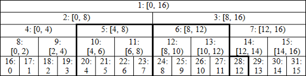

Lazy propagation
---

[번역 원본 LINK](https://codeforces.com/blog/entry/18051)

​	Lazy propagation(지연 전파)라고 하는 range에 쿼리 및 수정을 모두 수행하는 기술을 설명할 것이다. 먼저 더 많은 변수들이 필요하다:

```c++
int h = sizeof(int) * 8 - __builtin_clz(n);
int d[N];
```

​	**h**는 트리의 높이로 n에서 가장 중요한 비트이다. **d[i]**는 필요할 때 노드 i의 자식으로 전파되는 지연된 작업이다(예제에서 더욱 명확해질 것이다). 리프에 대한 이 정보를 저장할 필요가 없기 때문에 배열의 크기가 N이다. 이로 인해 총 3 * n 메모리 사용량이 발생한다.

​	이전에는 **tree[i]**가 세그먼트에 해당하는 값이라고 말할 수 있었다. 지금은 아니다. 먼저 노드 i에서 트리의 루트까지의 경로에서 지연된 모든 작업을 적용해야한다. tree[i]에 이미 d[i]가 포함되어 있으므로 경로가 i로 시작하지 않고, 부모로 시작한다고 가정한다.

​	범위 [3, 11)를 사용해 첫 번째 예로 돌아가보자. 이제 이 범위 내의 모든 요소를 수정하려고 한다. 이를 위해 노드 19, 5, 12, 26에서 tree[i] 및 d[i]를 수정한다. 나중에 노드 22에서 값을 요청하면 노드 5 밑으로 수정을 전파해야한다. 수정 사항은 트리의 tree[i] 값에도 영향을 미칠 수 있다. 노드 19는 노드 9, 4, 2, 1에 영향을 미치고 노드 5는 2와 1에 영향을 준다. 다음 사실은 작업의 복잡성에 중요하다.

​	**범위 [left, right)에 대한 수정은 border leaves의 부모 (l + n 및 r + n - 1)에서만 tree[i] 값에 영향을 준다 (범위를 구성하는 값은 예외이다 - for 루프에서 액세스한 값).**

​	증명은 간단하다. 왼쪽 경계를 처리 할 때 루프에서 수정하는 노드는 항상 부모의 오른쪽 자식이다. 그런 다음 이전의 모든 수정은 동일한 부모의 왼쪽 자식 하위 트리에서 수행되었다. 그렇지 않으면 두 자식 대신 부모를 처리한다. 이것은 현재 직계 부모도 리프 left + n 의 부모임을 의미한다. 유사한 인수가 오른쪽 테두리에 적용된다.

​    

**Increment modifications, queries for maximum**

​	이것은 아마도 가장 간단한 경우이다. 아래 코드는 보편적이지 않고 가장 효율적이지는 않지만 시작하기에 좋다.

```c++
void apply(int position, int value)
{
  tree[position] += value;
  if (position < n)
  {
    d[p] += value;
  }
}

void build(int position)
{
  while (position > 1)
  {
    p>>=1;
    tree[position] = max(tree[position<<1], tree[position<<1|1]) + d[p];
  }
}

void push(int position)
{
  for (int s = h; s > 0; --s)
  {
    int i = p >> s;
    if (d[i] != 0)
    {
      apply(i<<1, d[i]);
      apply(i<<1|1, d[i]);
      d[i] = 0;
		}
  }
}

void inc(int left, int right, int value)
{
  left += n;
  right += n;
  
  int left0 = left, right0 = right;
  
  for (; left < right; left >>= 1, right >>= 1)
  {
    if (left & 1)
    {
      apply(left++, value);
    }
    if (right & 1)
    {
      apply(--right, value);
    }
  }
  
  build(left0);
  build(right0 - 1);
}

int query(int left, int right)
{
	left += n;
  right += n;
  
  push(left);
  push(right - 1);
  
  int result = -2e9;
  for (; left < right; left >>= 1, right >>= 1)
  {
    if (left & 1)
    {
			result = max(result, tree[left++]);
    }
    if (right & 1)
    {
			result = max(tree[--right], result);
    }
  }
  
  return result;
}
```

​	한 번에 하나씩 분석해보자. 처음 세 가지는 사용자가 실제로 알 필요가 없는 도우미 메소드이다.

1. 이제 모든 내부 노드에 대해 2개의 변수가 있으므로 2가지 모두에 변경 사항을 적용하는 메소드를 작성하는 것이 유용하다. p < n 은 p가 리프인지 아닌지 확인한다. 작업의 중요한 특성은 일정 간격의 모든 요소를 한 값씩 늘리면 최대 값이 같은 값만큼 증가한다는 것이다.
2. **build** 는 주어진 노드의 모든 부모를 업데이트하도록 설계되었다.
3. **push** 는 지정된 노드의 모든 부모에서 루트부터 시작해 트리 아래로 변경 사항을 전파한다. 이 부모는 정확히 이진 표기법에서 position의 prefix 이므로 이진 shift를 사용해 계산한다.

​	이제 우리는 주요 메소드를 볼 준비가 되었다.

1. 위에서 설명한 것처럼 익숙한 루프를 사용해 증가 요청을 처리한 다음 **build** 를 호출해 필요한 모든 것을 업데이트한다.
2. **query** 에 답하기 위해 이전과 동일한 루프를 사용하지만, 그 전에 모든 변경 사항을 사용할 노드에 푸시해야한다. **build** 와 마찬가지로 border leaf의 부모에서 변경 사항을 푸시하는 것으로 충분하다.

​	위의 모든 작업은 O(log n) 시간 복잡도가 걸린다는 것을 쉽게 알 수 있다. 다시 말하지만, 이것은 두 가지 이유 때문에 가장 간단한 경우이다.

1. 수정 순서는 결과에 영향을 주지 않는다.
2. 노드를 업데이트 할 때 그것이 나타내는 간격의 길이를 알 필요가 없다.

​	다음 예제에서 이를 고려하는 방법을 보여주겠다.

​    

**Assignment modifications, sum queries**

​	다시, helper function부터 시작하자. 이제 우리는 더 많은 것을 가지고 있다.

```c++
void calc(int position, int k)
{
  if (d[position] == 0)
  {
    tree[position] = tree[position<<1] + tree[position<<1|1];
  }
  else
  {
    tree[position] = d[position] * k;
  }
}

void apply(int position, int value, int k)
{
  tree[position] = value * k;
  if (position < n)
  {
    d[position] = value;
  }
}
```

​	이들은 노드 position에서 값을 계산하고 노드에 변경 사항을 적용하는 단순한 O(1) 시간복잡도 함수이다. 그러나 설명할 두 가지가 있다.

1. 수정에 사용하지 않는 값이 있다고 가정하자. 우리의 경우에는 0이다. 그러한 값이 없는 경우 - 추가 부울 배열을 만들고 d[position] == 0 을 확인하는 대신 부울 배열을 참조한다.
2. 이제 노드 position에 해당하는 간격의 길이를 나타내는 추가 매개 변수 k가 있다. 이 의미를 보존하기 위해 코드에서 이 이름을 일관되게 사용할 것이다. 분명히 이 매개 변수없이 합계를 계산하는 것은 불가능하다. 별도의 배열에 있는 모든 노드에 대해 이 값을 미리 계산하거나 노드 인덱스에서 즉석에서 계산하는 경우 이 매개 변수 전달을 피할 수 있지만, 추가 메모리나 계산을 사용하지 않는 방법을 보여주겠다.

​	다음으로 build 및 push 메소드를 업데이트해야 한다. 두 가지 버전이 있다. 하나는 O(n)에서 전체 트리를 처리하는 이전에 소개한 것, 다른 하나는 O(log n)에서 한 잎의 부모만 처리하는 마지막 예에서 가져온 것이다. 이 기능을 하나의 방법으로 쉽게 결합하고 더 많은 것을 얻을 수 있다.

```c++
void build(int left, int right)
{
	int k = 2;
  for (left += n, right += n - 1; left > 1; k <<= 1)
  {
    left >>= 1;
    right >>= 1;
    for (int i = right; i >= left; --i)
    {
      calc(i, k);
    }
  }
}

void push(int left, int right)
{
  int s = h, k = 1 << (h - 1);
  for (left += n, right += n - 1; s > 0; --s, k >>= 1)
  {
    for (int i = l >> s; i <= r >> s; ++i)
    {
      if (d[i] != 0)
    	{
        apply(i<<1, d[i], k);
        apply(i<<1|1, d[i], k);
        d[i] = 0;
      }
  }
}
```

​	이 두 방법 모두 O(log (n) + |right - left|) 시간의 모든 간격에서 작동한다. 트리에서 일부 간격을 변환하려면 다음과 같은 코드를 작성할 수 있다.

```c++
push(left, right);
. . . // do anything we want with elements in interval [left, right)
build(left, right);
```

​	그들이 어떻게 작동하는지 설명하자. 먼저 부모를 올바르게 계산하기 위해 right += n - 1을 수행해 구간을 닫힘으로 변경한다. 레벨별로 트리 레벨을 처리하기 때문에 현재 간격 레벨을 유지하기가 쉽지 않다. 이 간격 레벨은 항상 2의 거듭 제곱이다. **build** 는 아래에서 위로 이동하므로 k를 2로 초기화하고(리프에 대해 아무것도 계산하지 않고, 직계 부모로 시작하기 때문에 1이 아니다), 각 레벨에서 두 배로 늘린다. **push** 는 위에서 아래로 이동하므로 k의 초기 값은 여기에서 나무의 높이에 따라 다르며 각 레벨에서 2로 나뉜다.

​    

​	주요 메소드는 마지막 예제에서 많이 변경되지 않지만 modify에는 2가지 사항이 있다.

1. 수정 순서가 중요하기 때문에 루트에서 업데이트 할 모든 노드까지의 경로에 이전 변경 사항이 없는지 확인해야한다. query에서 했던 것처럼 push를 먼저 호출하면 된다.
2. k의 값을 유지해야한다.

```c++
void modify(int left, int right, int value)
{
  if (value == 0)
    return;
  
  push(left, left + 1);
  push(right - 1, right);
  int left0 = left, right0 = right, k = 1;
  for (left += n, right += n; left < right; left >>= 1, right >>= 1, k <<= 1)
  {
    if (left & 1)
    {
      apply(left++, value, k);
      apply(--right, value, k);
    }
  }
  build(left0, left0 + 1);
  build(right0 - 1, right0);
}

int query(int left, int right)
{
  push(left, left + 1);
  push(right - 1, r);
  int result = 0;
  for (left += n, right += n; left < right; left >>= 1, right >>= 1)
  {
    if (left & 1)
    {
      result += tree[left++];
    }
    if (right & 1)
    {
      result += tree[--right];
    }
  }
  
  return result;
}
```

​	거의 동일한 노드에 대해 3개의 전달된 수정 작업을 수행하는 것을 알 수 있다. 1은 push 트리 아래로, 2는 트리 위로 이동한다. 마지막 패스를 제거하고 필요한 경우에만 새 값을 계산할 수 있지만 코드는 더 복잡해진다.

```c++
void modify(int left, int right, int value)
{
  if (value == 0)
    return;
  
  push(left, left + 1);
  push(right - 1, right);
  bool cLeft = false, cRight = false;
  int k = 1;
  for (left += n, right += n; left < right; left >>= 1, right >>= 1, k <<= 1)
  {
		if (cLeft)
    {
      calc(left - 1, k);
    }
    if (cRight)
    {
      calc(right, k);
    }
    if (left & 1)
    {
      apply(left++, value, k), cLeft = true;
      apply(--right, value, k), cRight = true;
    }
  }
  
  for (--left; right > 0; left >>= 1, right >>= 1, k <<= 1)
  {
    if (cLeft)
    {
      calc(left, k);
    }
    if (cRight && (!cLeft || left != right))
    {
      calc(right, k);
    }
  }
}
```

​	부울 플래그는 왼쪽과 오른쪽을 이미 변경했는지 여부를 나타낸다. 예를 살펴보자:



​	간격 [4,13)에서 modify를 호출한다

1. left = 20, right = 29, apply(28)을 호출한다.
2. left = 10, right = 14, calc(14)를 호출한다. 현재 간격의 오른쪽에 있는 첫 번째 노드는 정확히 마지막으로 수정된 노드의 부모이다.
3. left = 5, right = 7, calc(7)을 호출하고, apply(5)와 apply(6)을 호출한다.
4. left = 3, right = 3, 첫 번째 루프가 끝났다.

​	이제 노드 2, 3, 1에서 새 값을 계산해야 하기 때문에 --left를 수행하는 지점을 볼 수 있다. 첫 번째 이후 left = 1, right = 1을 얻을 수 있기 때문에 끝 조건은 r > 0이다. 루프이므로 루트를 업데이트해야 하지만 --left 결과는 left = 0이다.

​	이전 구현과 비교해 불필요한 호출 calc(10), calc(5), calc(1)에 대한 중복 호출을 방지한다.