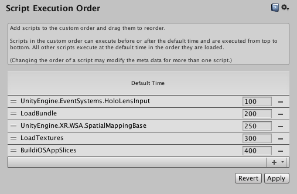
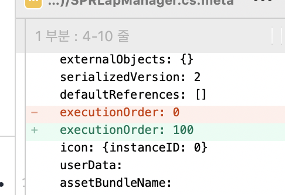

> 시작하면서

​	Unity에서 Start()를 호출할 때 다른 스크립트와 오브젝트들을 불러와야하는데, 스크립트의 순서가 명확해야하는 상황이 생겼다. c/c++에서 작업했다면 따로 manager를 하나 만들어서 order를 정했을 상황이지만, unity에서는 따로 제공하고 있는 기능이 있을것 같아서 구글링을 통해 방법을 찾았다.

   

> 방법

​	[Unity Document](https://docs.unity3d.com/Manual/class-MonoManager.html)

​	방법은 간단했다. **(version : Unity 2019.3.15f1)**

```
Edit -> Project Settings -> Script Execution Order
```



​	위의 경로로 들어가서 (+) 버튼을 눌러 스크립트를 추가하고 order를 입력하면 된다. 범위는 **-32000 ~ 32000**까지 가능한데, 사용하고 있는 범위가 적은데 일정 범위 이상으로 설정하면 unity에서 자체적으로 range를 줄여서 조정한다. (추후에 들어올 스크립트를 생각해서 작업하려고 했는데 매우 불편하다. 해결 방법이 있는지 찾아봐야겠다)

​	**Default Time** 이 기본 스크립트 기준이고, Default Time은 0이다. 우리가 직접 작성한 스크립트들은 기본적으로 Default Time이 0이다. 그에 맞추어 다른 스크립트들보다 일찍 실행시키고 싶으면 (-) 가중치를, 늦게 실행시키고 싶으면 (+) 가중치를 주면 된다. 



​      

> 마무리

​	Unity의 방대한 기능 제공 **Good**