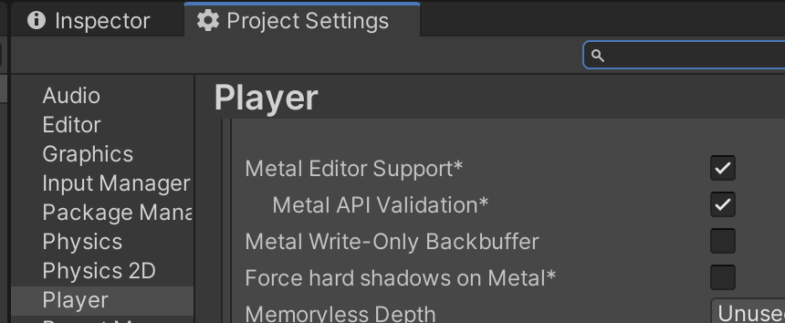
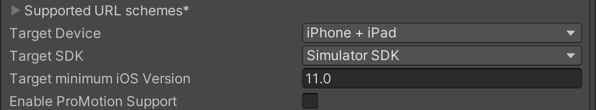
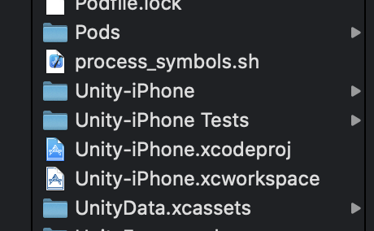
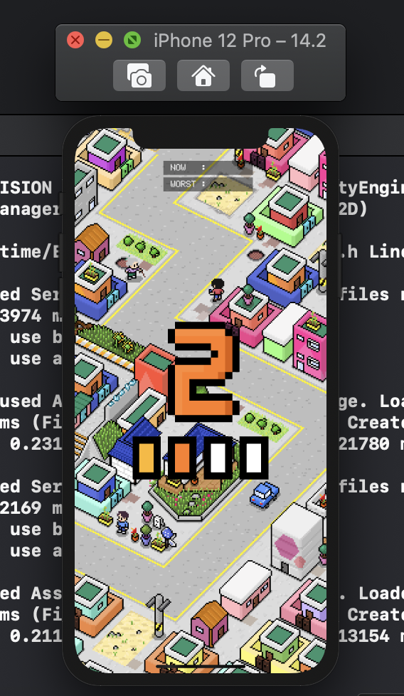
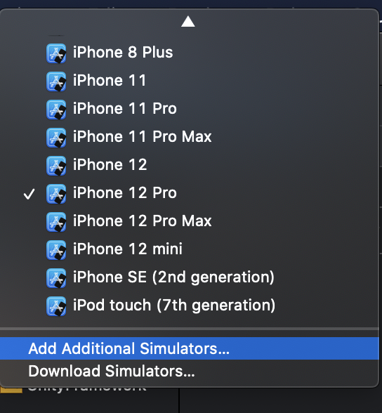

***해당 글은 MacOS 기준으로 작성했습니다***

> 시작하면서

​	Unity는 Game Viewer가 있기 때문에 따로 빌드를 하지 않아도 테스트가 가능하다. 하지만 실제 기기가 아니기 때문에 다양한 예외 사항이 발생한다. 그렇기에 나는 Xcode에서 제공하는 Simulator로 테스트하는 것을 선호한다 (회사에서도 시뮬레이터를 사용해서 익숙한 이유도 있다).

​	예전에는 Android Studio나 Xcode 시뮬레이터들을 이용할 때 렉이 많이 걸려서 테스트하기가 힘들었는데, 최근(?)에 iOS Metal이 시뮬레이터에 적용되면서 쾌적한 환경으로 테스트가 가능해졌으니 강력하게 추천한다.

   

> 주의사항

​	우선 주의사항을 먼저 말하자면 Unity/Xcode/MacOS 버전이 중요하다. Unity 버전은 **2020.1.12f1**이고, 다른 버전들은 아래쪽에 천천히 나온다.

**Project Setting -> Player -> iOS -> Metal Editor Support/Metal API Validation**

​	먼저 쾌적한 환경에서 시뮬레이터를 사용하기 위해 Metal을 필수적으로 사용할 것이다(실제 게임 빌드에도 사용할 것이고). 위 경로로 들어가서 둘 다 체크해준다.

​    

​	그리고 조금 더 내려가면 **Target SDK**가 있는데, Target을 **Simulator SDK**로 변경해준다.

​    

​	다 설정헀다면 **command + shift + b** 를 눌러서 Build Setting를 켜준다. iOS로 플랫폼을 잡으면 위와 같은 알림이 뜬다.

​	Metal을 사용하기 위해서는 **Xcode11 & MacOS 10.15** 이상을 맞추어야한다는 알림이다. 만약 해당 버전보다 낮으면 업그레이드를 해야한다. 모든 조건이 충족되었다면 Build를 눌러서 Xcode 빌드를 한다.

​    

​	

​	빌드 후에는 위와 같이 여러 파일들이 있는데 이중에서 **Unity-iPhone.xcworkspace** 를 실행한다.

​    

​	실행하고 나면 좌측 상단에 재생 버튼과 시뮬레이터를 설정하는 곳이 있다. 본인이 테스트하고 싶은 시뮬레이터를 선택하고 재생 버튼을 누르면 빌드 후 시뮬레이터에서 실행된다.

**iPhone 12 Pro Simulator**

​    

​    

​	Xcode를 설치할때 버전별로 기본 Simulator가 존재하는데, 특정한 OS 버전의 시뮬레이터를 설치하고 싶으면 우측의 시뮬레이터 버튼을 클릭하고, 아래와 같은 화면에서 **Add 혹은 Download** 버튼을 클릭해서 시뮬레이터를 추가 및 다운로드 해주면 된다.

​    

**tip : Unity에서 출력되던 debug log도 xcode에서 확인이 가능하다. xcode layout을 건드리지 않았다면 중앙 하단 우측 layout에서 log가 나온다.**

​    

> 마무리

​	내가 학부 시절에는 이런 소소한 테스트 팁이 없어서 시간을 많이 낭비했던 적이 있었다. 내 글이 서툴러서 초심자 분들에게 친절할지는 모르겠지만, 이 글을 통해 테스트 시간을 조금이라도 줄일 수 있길 바래본다.