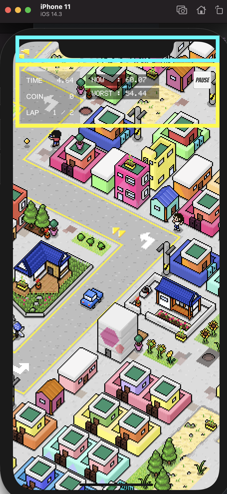

***해당 글은 MacOS 기준으로 작성했습니다***

> 시작하면서

​	모바일 플랫폼에서 개발하면 반드시 대응해야하는 부분이 기기의 **노치 디자인**이다. 요즘 새로 나오는 기기들은 대부분 노치 디자인을 가지고 있기 때문에 필수로 대응을 해야한다. Unity에서는 **Screen.SafeArea** 를 사용해서 노치 디자인에 대한 UI 대응을 쉽게 할 수 있다.

**[Unity 공식 링크](https://connect.unity.com/p/updating-your-gui-for-the-iphone-x-and-other-notched-devices)**

   자세한 설명은 위 링크를 보면 되고, 이 글에서는 **portrait (세로 고정)** 기준으로 코드를 작성했다.

​    

> 코드

```c#
using UnityEngine;

public class UISafeAreaManager : MonoBehaviour
{
    public static void ApplySafeAreaPosition(RectTransform rt)
    {
        Rect safeArea = Screen.safeArea;

        // Convert safe area rectangle from absolute pixels to normalised anchor coordinates
        Vector2 anchorMin = safeArea.position;
        Vector2 anchorMax = safeArea.position + safeArea.size;

        // 기존 anchor x 좌표 사용
        anchorMin.x = rt.anchorMin.x;
        anchorMax.x = rt.anchorMax.x;

        anchorMin.y /= Screen.height;
        anchorMax.y /= Screen.height;

        rt.anchorMin = anchorMin;
        rt.anchorMax = anchorMax;
    }
}
```

​    

​	Unity 공식 링크에서의 코드와 다른 점은 **ApplySafeAreaPosition** 함수를 **static**으로 선언해서, **RectTransform** 을 넘기는 방식으로 적용하고, **anchor**의 min, max **x** 값은 기존 값으로 사용한다.

​	**x** 값을 기존 값으로 사용하는 이유는 에디터에서 **top left, top right** 로 설정한 UI를 그대로 유지해주기 위함이다. (화면이 돌아가지 않으므로 수정할 필요가 없음)

​    




**Safe Area가 적용된 모습**

​    

> 마무리

​	이 글은 철저히 **회전하지 않는 세로 게임 기준**의 코드이다. 회전이 필요한 경우에는 위쪽에 있는 Unity 공식 링크의 글을 보기를 추천한다.

